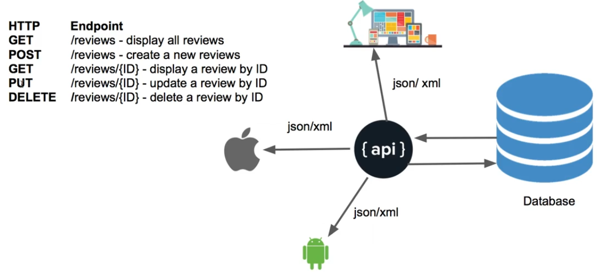
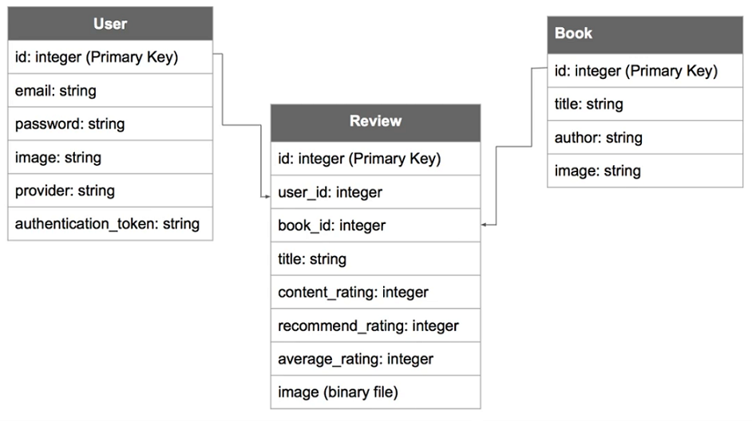

# book-review-system

Notes from [Udemy's RESTful APIs With Ruby On Rails 5 Course](https://www.udemy.com/course/restful-api-with-ruby-on-rails-5)

**So, What's REST API?**

Before answering this, we have to answer what's an API?

> API stands for Application Programming Interface and software programs use APIs to communicate with each other.

Usually, clients such as mobile apps or web front-end use APIs to communicate with application server.

> REST stands for REpresentational State Transfer and it's an architectural style that use HTTP requests to GET, PUT, POST, and DELETE data.

**Application Database Design**

